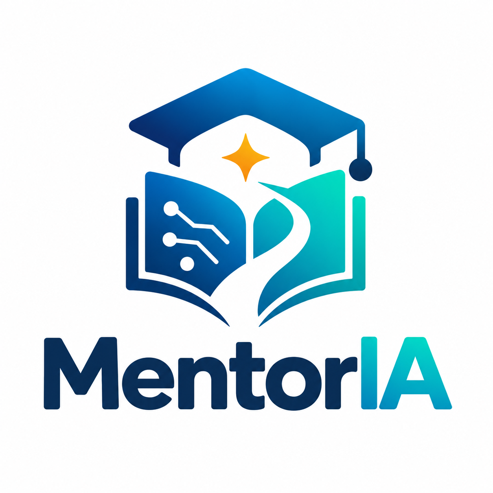

### Orientação personalizada para transformar dificuldade em evolução

**GCC129 — Sistemas Distribuídos | UFLA | 2026/2**

---

## O problema

Nem todos os estudantes possuem as mesmas dificuldades ou aprendem no mesmo
ritmo. Ainda assim, muitas vezes recebem o mesmo tipo de acompanhamento durante
a preparação para provas e redações.

Os dados mostram que esse cenário ainda representa um grande desafio:

### 7 em cada 10¹

estudantes brasileiros ficaram abaixo do nível básico de proficiência em
**Matemática** no PISA 2025.

### Menos de 5%²

dos estudantes da 3ª série do Ensino Médio público apresentavam aprendizagem
adequada simultaneamente em **Língua Portuguesa e Matemática**, em 2023.

> Esses dados reforçam a necessidade de um apoio mais individualizado e
> direcionado às dificuldades de cada estudante.

---

## A solução

A **MentorIA** é uma plataforma de apoio aos estudos voltada a estudantes da
rede pública, com foco na preparação para **provas e redações**.

A proposta é adaptar a preparação do aluno às suas principais dificuldades por
meio de três funcionalidades:

### Plano de estudos personalizado

Conteúdos e atividades organizados de acordo com o desempenho e as dificuldades
de cada estudante.

### Feedback com IA

Orientações sobre atividades e redações, indicando pontos fortes e aspectos que
podem ser melhorados.

### Acompanhamento da evolução

Visualização do progresso do estudante ao longo dos estudos, simulados e
produções de texto.

> **Preparação mais direcionada, personalizada e acessível.**

---

## Por que usar Inteligência Artificial?

A inteligência artificial está diretamente relacionada a dois objetivos da
MentorIA: oferecer **feedback individualizado** e apoiar a **personalização da
aprendizagem**.

### Feedback de redações³

Pesquisas indicam que o feedback automatizado pode contribuir positivamente para
o desenvolvimento da escrita.

Uma meta-análise publicada em 2023 reuniu **20 estudos e 2.828 estudantes** e
encontrou um efeito médio positivo do feedback automatizado sobre o desempenho
na escrita.

### Aprendizagem personalizada⁴

Pesquisas sobre educação adaptativa mostram que a IA pode auxiliar na
identificação de perfis de aprendizagem, previsão de desempenho e adaptação de
conteúdos às necessidades individuais.

Uma revisão sistemática publicada em 2025 analisou **142 estudos empíricos**
sobre o uso de IA em ambientes de aprendizagem personalizada.

> **Na MentorIA, a IA funciona como apoio ao aluno, não como substituta do professor.**

---

## Impacto social

A MentorIA busca ampliar o acesso de estudantes da rede pública a uma forma de
acompanhamento mais individualizada durante seus estudos.

### Mais direcionamento nos estudos

Identificação das principais dificuldades de cada estudante.

### Maior autonomia

Acompanhamento da própria evolução e dos objetivos de estudo.

### Apoio mais acessível

Ampliação do acesso a uma preparação mais individualizada para estudantes da
rede pública.

### Como podemos medir esse impacto?

O impacto da plataforma poderá ser acompanhado por indicadores como:

- evolução do desempenho em atividades e simulados;
- evolução entre diferentes versões de uma redação;
- cumprimento dos objetivos definidos no plano de estudos;
- redução de dificuldades recorrentes ao longo do tempo.

> **Impacto esperado: ajudar estudantes a estudar de forma mais eficiente,
> consciente e personalizada.**

---

## Público-alvo

A MentorIA é voltada principalmente a **estudantes de escolas públicas** que
buscam apoio na preparação para provas e redações e que poderiam se beneficiar
de uma orientação de estudos mais personalizada.

---

## Integrantes

| Integrante |
| --- |
| Gracielle Ázara |
| Marcos Silva |
| Matheus Cunha |
| Miguel Coelho |

---

## Referências

**[1] OECD.** *PISA 2025 Results (Volume I): Brazil*. OECD Publishing, 2026.

**[2] TODOS PELA EDUCAÇÃO.** *Anuário Brasileiro da Educação Básica 2025*.
Capítulo 4 — Ensino Médio. São Paulo: Todos Pela Educação, 2025.

**[3] FLECKENSTEIN, Johanna; LIEBENOW, Lucas W.; MEYER, Jennifer.**
*Automated feedback and writing: a multi-level meta-analysis of effects on
students' performance*. Frontiers in Artificial Intelligence, v. 6, 2023.
DOI: 10.3389/frai.2023.1162454.

**[4] HARIYANTO; KRISTIANINGSIH, Francisca Xaveria Diah; MAHARANI, Rizqona.**
*Artificial intelligence in adaptive education: a systematic review of
techniques for personalized learning*. Discover Education, v. 4, art. 458,
2025. DOI: 10.1007/s44217-025-00908-6.

---

## Status do projeto

O projeto encontra-se atualmente na etapa de concepção e definição da proposta.
A implementação do sistema será desenvolvida de forma incremental nas próximas
etapas da disciplina.

As instruções de execução serão adicionadas ao README conforme os serviços forem implementados.

---

### MentorIA

**Orientação personalizada para transformar dificuldade em evolução**

