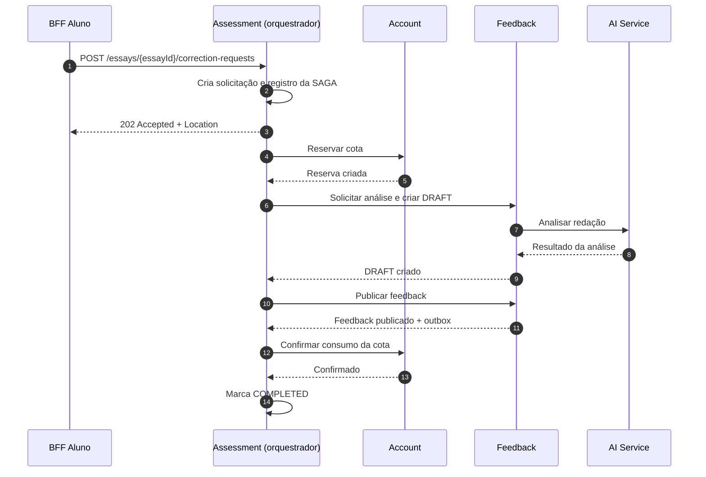

# SAGA — Solicitação de Correção de Redação

## Objetivo

A SAGA coordena a solicitação de correção de uma redação na MentorIA, garantindo que os serviços envolvidos concluam suas etapas ou executem compensações em caso de falha.

## Estratégia escolhida

Será utilizada uma **SAGA orquestrada**, coordenada pelo serviço **Assessment**. Essa abordagem centraliza o estado e a sequência da operação.

A transação envolve três serviços:

- **Assessment:** cria a solicitação e coordena a SAGA.
- **Account:** reserva e confirma o consumo da cota de correções.
- **Feedback:** solicita a análise ao AI Service e prepara e publica o feedback.

O **AI Service** realiza a análise da redação. O **Study Plan** fica fora desta SAGA; atualizações do plano são tratadas separadamente por eventos reprocessáveis.

## Fluxo e compensações

| Etapa | Serviço | Ação | Em caso de falha |
|---|---|---|---|
| 1 | Assessment | Cria solicitação `PROCESSING` e registra a SAGA. | Marca `FAILED` ou `REJECTED`. |
| 2 | Account | Reserva uma unidade da cota. | Libera a reserva. |
| 3 | Feedback | Solicita análise ao AI Service e salva feedback como `DRAFT`. | Cancela o rascunho e libera a reserva. |
| 4 | Feedback | Publica o feedback e grava `FeedbackPublished` na outbox. | É o ponto pivô: após a publicação, a SAGA avança até concluir. |
| 5 | Account | Confirma o consumo da reserva. | Repete a operação em caso de falha técnica. |
| 6 | Assessment | Marca a solicitação `COMPLETED`. | Repete a operação em caso de falha técnica. |

A reserva já conta contra a cota disponível. Portanto, um atraso na confirmação não permite ultrapassar o limite. Depois que o feedback é publicado, a cota não é devolvida.

## Caminho feliz

1. O aluno solicita a correção e recebe `202 Accepted` com um link para consultar o estado.
2. Assessment reserva a cota por meio de Account.
3. Feedback pede a análise ao AI Service e grava o resultado como rascunho.
4. Assessment solicita a publicação do feedback.
5. Account confirma o consumo da cota.
6. Assessment marca a solicitação como `COMPLETED`.

### Diagrama de sequência



## Falha e compensação

Se o AI Service estiver indisponível, Feedback retorna erro após as tentativas configuradas. Assessment inicia a compensação: cancela o rascunho, libera a reserva e marca a solicitação como `FAILED`. A redação original permanece salva, e o aluno pode solicitar uma nova correção.

### Diagrama de sequência

```mermaid
sequenceDiagram
    autonumber
    participant C as BFF Aluno
    participant AS as Assessment (orquestrador)
    participant AC as Account
    participant FB as Feedback
    participant AI as AI Service

    C->>AS: Solicitar correção
    AS-->>C: 202 Accepted + Location
    AS->>AC: Reservar cota
    AC-->>AS: Reserva criada
    AS->>FB: Solicitar análise
    FB-xAI: AI Service indisponível
    FB-->>AS: Erro após tentativas
    AS->>FB: Cancelar DRAFT, se existir
    FB-->>AS: Cancelado ou inexistente
    AS->>AC: Liberar reserva
    AC-->>AS: Reserva liberada
    AS->>AS: Marca FAILED
